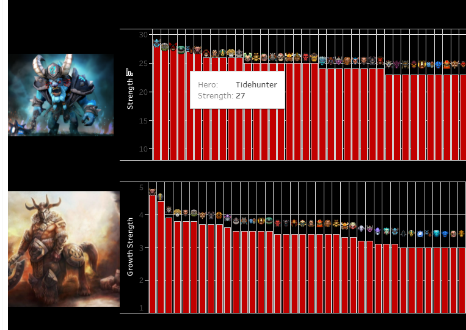
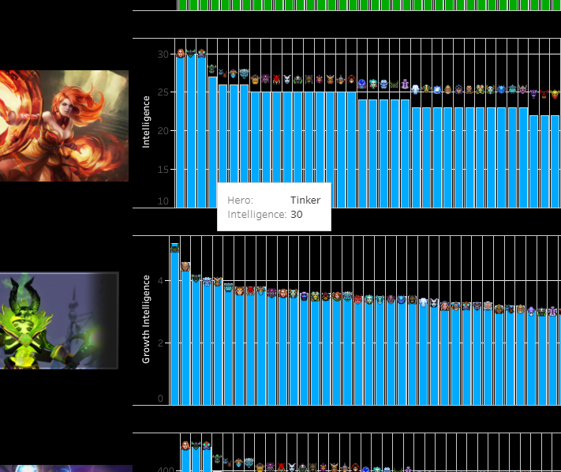
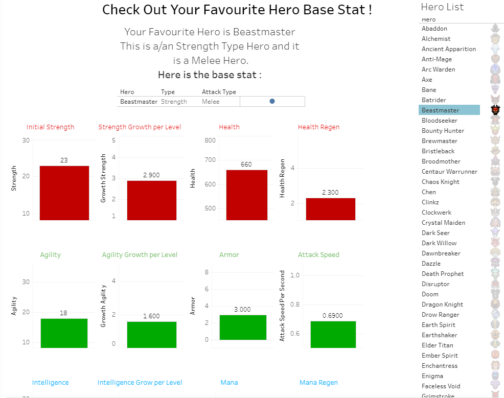

# Dota-2-Hero-Base-Stat-Visualization
### Web Scraping using Selenium and Visualization using Tableau
 

  
   

  

### This project is used for somebody who love and play Dota 2. This visualization is able to help you determine which hero has the best base stat in this patch (7.29)  

#### Step of processing :  

1. First step is to use Selenium to scrape the data
2. The website I choose is <a href='https://dota2.fandom.com/wiki/Dota_2_Wiki'>Dota 2 Fandom</a> because this website is fast update with the new patch 7.29 (Dawnbreaker included)
3. Scrap the important data from the hero
4. Download the icon of each hero for better visualization
5. Preprocess the data using pandas (cleaning data and make the data easy to visualize)
6. Visualize the data using tableau public

You can check the results in my <a href='https://public.tableau.com/profile/johan.klemantan.widagdo#!/vizhome/Dota27_29HeroBaseStat/Story1'>Tableau profile here </a>
 
Here is some spotlight of the result :

  
   

  

You can also check the base stat of your favourite hero there!    

Feel free to check my tableau profile <a href='https://public.tableau.com/profile/johan.klemantan.widagdo#!/'>Here</a>

### Thankyou
### Happy Coding !
